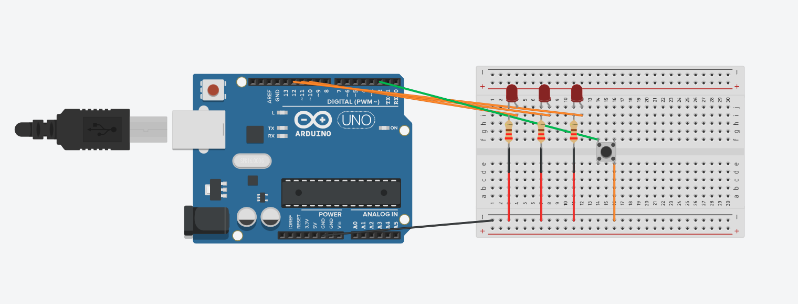

# Reaction Timer
A simple Arduino-based project to test and record human reflex speed in milliseconds.

## Hardware Components
- Arduino Uno
- Push-button
- LED
- 220Ω Resistor
- Breadboard & Jumper Wires

## Circuit Diagram

## How it works
This system acts as a reflex tester. It waits for a random delay, lights up the LED to signal the user, and then measures the exact time (in milliseconds) it takes for the user to press the push-button. The result is then displayed on the Serial Monitor.

## Usage
1. Connect the hardware as shown in the diagram.
2. Upload the `reaction_timer.ino` code to your Arduino.
3. Open the Arduino IDE Serial Monitor (set to 9600 baud) to see your reaction speed results!
